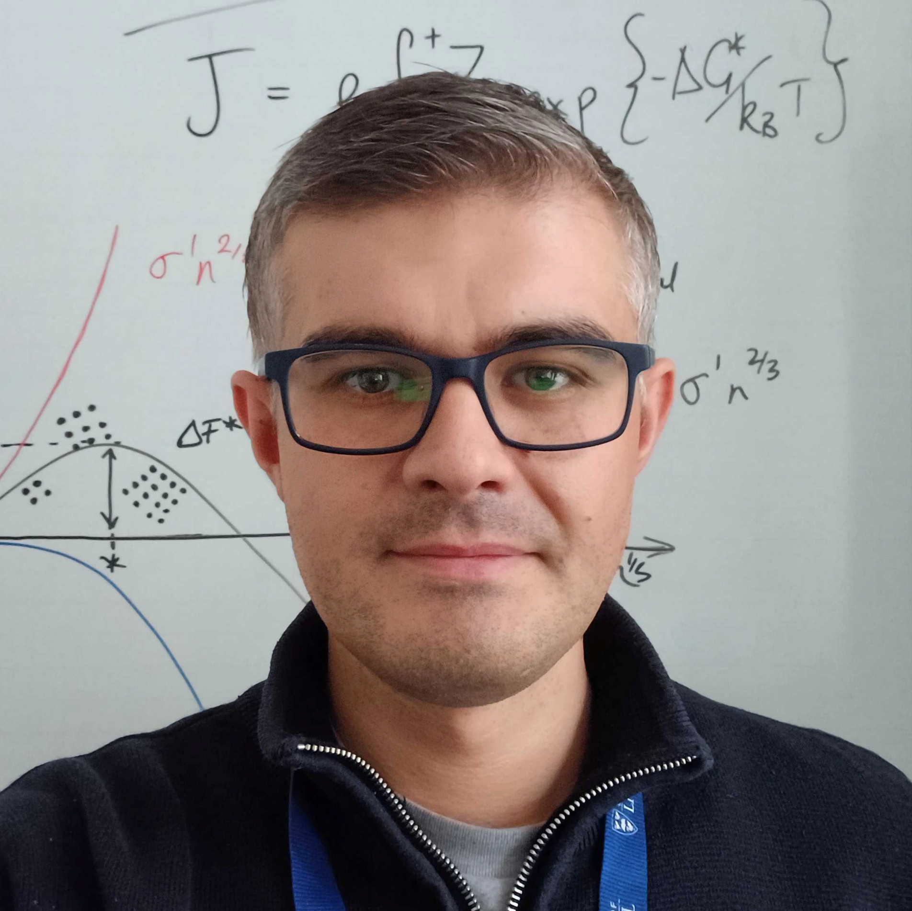

## Aaron Finney, Principal Investigator

  

    
Aaron is a Lecturer in Materials Science in the School of Engineering. He completed his PhD in Chemistry and Scientific Computing at the University of Warwick. From 2016 to 2019 he was an EPSRC Doctoral Prize Fellow and then Research Associate in Materials Science and Engineering at the University of Sheffield. Before moving to Liverpool in 2023, Aaron was a Senior Research Fellow in Chemical Engineering at University College London.

    
<a href="https://www.liverpool.ac.uk/people/aaron-finney"><strong>University profile</strong></a> • <a href="https://scholar.google.com/citations?user=zHvnvwsAAAAJ"><strong>Google Scholar</strong></a>

  

  

## Xavier Sottrel, PhD candidate (2026–)  
Short description of project and bio

## Shaurya Aneja, PhD candidate (2026–)  
Short description of project and bio

## Varnit Jain, PhD candidate (2025–)  
Short description of project and bio

## Join us

We welcome enquiries about PhD projects and fellowship applications. Please [get in touch](contact.md).
